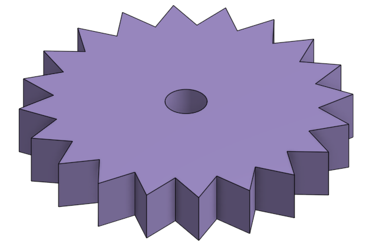

### CAD Projects

## GEAR RATIOS

(gear_ratios folder)

# About This Project :

" This project is a computer-aided design (CAD) to help understanding the concept of gear ratio "

- What is a gear ?

    * A gear is a rotating circular machine element with teeths which mesh with another toothed part to transmit torque and speed.

    * A 20 tooth gear :

    

# Why ?

- 

# Basic Instruction : 

    1. 

    2. 

[1_16_compound_gear_system.webm](https://user-images.githubusercontent.com/100845104/225464660-dc17dfb3-6d93-4071-925b-a7591c9b6b76.webm)
