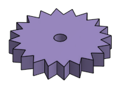

### CAD Projects

## GEAR RATIOS

(gear_ratios folder)

# About This Project :

" This project is a computer-aided design (CAD) to help understanding the concept of gear ratio "

- What is a gear ?

    * A gear is a rotating circular machine element with teeths which mesh with another toothed part to transmit torque and speed.

    * A 20 tooth gear :

    

    * A compound gear system :

    

- Why to use a gear ?

1. Maintain axe rotation synchronized
2. Decrease or increase speed of rotation
3. Reverse Rotation Direction
4. Move rotational motion to a differente axis
5. Increase of Decrease torque

- Gear Ratio 

    * To  understand the concept of gear ratio, imagine a gear without teeth, this means this is a circle. The circumference of a circle is equal to the diameter of the circle multiplied by Pi .
    
    For Example, a gear with 1 inch diameter, have approximately 3.14 inches of circumference. A second gear with 0.635 inch diameter have approximately 2 inches of circumference.
     
    Rolling the second gear counter clockwise against the first one will make the first gear to rotate clockwise. 
    
    The second gear has to spin twice to cover the same distance covered by the first gear, explaining a 2:1 gear ratio

    * In real life gears have teeth , this avoid slippage. To determine gear ratios just divide the number of teeth in the two gears

    Example :

    

    

# Why ?

- 

# Basic Instruction : 

    1. 

    2. 

[1_16_compound_gear_system.webm](https://user-images.githubusercontent.com/100845104/225464660-dc17dfb3-6d93-4071-925b-a7591c9b6b76.webm)
